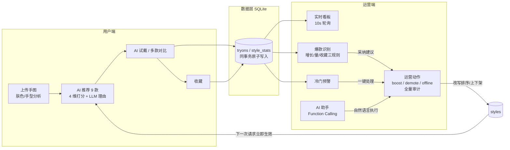

# 美甲 AI 试戴与智能运营

一个"双端共享同一条实时数据闭环"的 AI 应用：**用户端**上传手图即可获得个性化推荐并 AI 试戴美甲；**运营端**实时看到每一次试戴对大盘的影响，用规则+LLM 发现爆款与冷门，并通过界面或自然语言助手执行运营动作——动作即时改变下一个用户看到的内容。

> 起点是美团 AI 黑客松命题三（美甲 AI 试戴与智能运营）的参赛 demo，现作为个人 AI 协作开发（vibecoding）项目持续维护。全部 55 个构建步骤由 AI agent 实现、人工分级验收，过程完整留痕（见[开发过程](#ai-协作开发过程)）。

## 核心：数据闭环

产品的立身之本不是单个功能，而是这条**真实、同步**的环：



在运营端点"下架"，用户端下一次刷新它就消失；用户端每次试戴，运营端看板 10 秒内数字就动。演示时这条环是**可当场验证的**，不是预录的。

## 功能一览

| 端 | 模块 | 说明 |
|---|---|---|
| 用户端 | 手图上传 | 样例图/自拍上传，肤色与手型分析 |
| | 智能推荐 | 性别硬过滤 + 肤色 35% / 手型 30% / 热度 20% / 多样性 15% 打分，LLM 批量生成每款推荐理由 |
| | AI 试戴 | Seedream 4.5 真实图像合成（手图+款式图双条件）；MockProvider 永久兜底 |
| | 多款对比 / 结果页 | 并行试戴、滑块对比原图、收藏（写入闭环） |
| 运营端 | O1 实时看板 | 4 KPI 环比 + 7 日趋势 + 标签分布 + 24h 热力，10s 自动刷新 |
| | O2 爆款识别 | 3 日增长 ≥50% 且 24h ≥50 次且收藏率 ≥20%，一键采纳建议 |
| | O3 冷门预警 | 三规则任一命中即预警，按建议类型给真实动作按钮 |
| | O5 AI 助手 | Function Calling：5 个工具查数据/执行动作，全程审计，429 时降级为数据摘要（永不空白） |
| | O6 款式管理 | 全量上下架/排序，改动即时生效于用户端 |
| | O7 报告订阅 | APScheduler 定时（每日 09:00 / 周一 09:00，北京时间）+ 手动生成，LLM 日报/周报 → 站内信铃铛 + HTML 邮件 |

## 技术栈

React 18 + Vite + TypeScript + antd + Tailwind + ECharts ｜ FastAPI + SQLAlchemy(async) + SQLite + APScheduler ｜ LLM/VLM/图像生成统一走 PPIO（OpenAI 兼容 API）：`deepseek-v4-pro`（强推理/FC/报告）、`qwen3-next-80b`（轻量文案）、Seedream 4.5（试戴合成）。

## 值得一读的技术决策

| 问题 | 解法 | 记录 |
|---|---|---|
| API 限速 5 次/分钟（双档皆然） | 9 路并发改单次 batch 调用；FC 循环封顶 3 轮；每个 LLM 调用点自带用真实数据拼装的降级文案，界面永不空白 | progress.md Step 4.5 / Batch B |
| reasoning 模型日报稳定输出空白 | 诊断出思考 token 烧光预算（finish_reason=length，思考 3496 token 全花在自算环比）；根治 = **环比在代码层预计算**、模型只做文字组织 | progress.md Batch C |
| 图像生成不可依赖外部 API 存活 | `ImageGenProvider` 抽象 + MockProvider 兜底；邮件等副作用服务同样自带隔离档（DNS 必败域名走真实失败路径） | design-docu §8 |
| 定时任务时区 | 所有 CronTrigger 显式 `Asia/Shanghai`，UTC 主机不会晚 8 小时 | progress.md Batch C |
| 演示数据可复现 | seed 严格幂等（固定随机种子），删库重建后全链路可用 | scripts/seed_all.py |

## AI 协作开发过程

本项目是一次完整的 AI agent 主力开发实践：计划先行（55 步、每步带可验证的完成标准）→ 人工验收从逐步确认演进为按风险分级的批式验收 → 每步一个 commit 且验证结果写入提交信息。过程文档就在仓库里：

- [implementation-plan.md](implementation-plan.md) — 55 步构建计划（含每步验收标准）
- [memory-bank/progress.md](memory-bank/progress.md) — 全程实施记录：每步做了什么、验证结果、设计取舍与踩坑
- [HANDOFF.md](HANDOFF.md) — 跨会话/跨 agent 交接文档（工作流规则、锁定决策、环境坑）
- `git log` 本身 — 55 步的提交链与验证留痕

## 快速启动

```
# 0. 配置（首次）：backend/ 下复制 .env.example 为 .env，填入 PPIO_API_KEY
#    （SMTP 五项可留空：报告仍生成，仅邮件标记失败；IMAGE_PROVIDER=mock 为默认安全网）

# 1. 初始化数据（可重复执行；隔天演示前请重跑以刷新时间窗口）
cd backend
python -m venv .venv && .venv\Scripts\pip install -r requirements.txt   # 首次
.venv\Scripts\python.exe -X utf8 scripts\seed_all.py

# 2. 后端（8000）
.venv\Scripts\python.exe -m uvicorn app.main:app --port 8000

# 3. 前端（5173）
cd ../frontend && npm install && npm run dev
```

打开 `http://localhost:5173`：`/` 为双端入口。AI 助手连续提问建议间隔 30 秒（API 限速，超限自动降级为数据摘要回复）。

## 数据来源声明

款式图与手模样本来自美团 AI 黑客松命题三提供的比赛数据集（已脱敏），另含少量自行补充的男士款式样本，仅用于本 demo 的功能演示。`data-prep/` 为一次性数据准备脚本；`Meijia/` 为已弃用的早期原型，均非产品代码。
